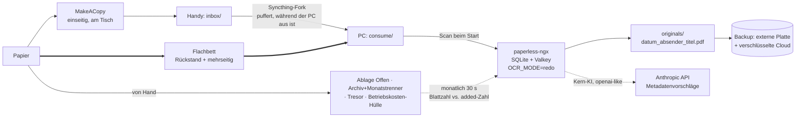

# 💡 Konzept: Private Papierablage — Erfassen, Indizieren, zwei Ablagen

## 📌 Status

`DRAFT` · v6 (v2 schrieb v1 durch Streichung neu; v3 arbeitete den Flachbett ein; v4 führte ein Framework „abgeschlossene Bände" ein und v5 strich es nach einer zweiten Gegenprüfung wieder; **v6 legt die Mengenannahme auf die Schätzung des Nutzers fest und streicht die Mess-Vorstufe — er will loslegen**)

| Feld | Wert |
|---|---|
| Erstellt | 2026-08-22 |
| Haushalt | 2 Erwachsene, 2 Kinder · eigenes Haus (Bau ~2023) · 2–3 vermietete Wohnungen |
| Erfassungsgerät | Android **plus vorhandener Flachbettscanner** (Nutzer, 2026-08-22) |
| Speicherung | Nur lokaler Rechner, nicht dauerhaft an (Nutzerentscheidung) |
| LLM | API-Aufrufe zur Interpretation akzeptabel; Speicherung bleibt lokal (Nutzerentscheidung) |
| Menge | **30–50 Stück/Monat** (Schätzung des Nutzers, 2026-08-23). Bewusst *nicht* genauer gemessen — er will loslegen. |
| Laufende Nummern | Gestrichen — Nutzer hat bestätigt, dass ihm das Beschriften des Papiers gleichgültig ist (2026-08-22) |
| Gegenprüfung (v6-Delta) | **Verzichtet — Rekalibrierung, keine Designentscheidung** (Mengenangabe + gestrichenes Mess-Gate). Die v5-Prüfung gilt für alles Übrige weiter. |
| Gegenprüfung | **„Überarbeiten"** → aufgelöst durch **Streichung**, siehe unten · Prüfer: **Same-Model-Fallback** (kein `reviewer_model` konfiguriert — die Prüfung teilt zu einem realen Teil die blinden Flecken der Selbstkritik) |

> ⚠️ **v1 dieses Konzepts war um vorgedruckte Nummern-Etiketten herum gebaut. Das ist jetzt gestrichen.**
> Das Kernargument der Prüfung hielt stand: Die Nummer löste ein Problem, das dieser Haushalt nicht
> hat, und alles, was daran hing — Etiketten-Nachschub, ein PDF-Zwang bei der Erfassung, ein stiller
> Fehlerpfad, sogar die Wahl des DMS — war Gerüst auf einem Nutzen von zwei Minuten pro Jahr. Was an
> die Stelle tritt, ist kleiner, braucht kein Verbrauchsmaterial und verlangt **gar keine Beschriftung
> des Papiers**.

---

## 🎯 Problemstellung

Täglich kommt Papier — Versicherungen, Rechnungen, Schule, Gemeinde, der Hausbau, die Mietwohnungen —
und parallel kommen Rechnungen per E-Mail und Geld bewegt sich über mehrere Konten. Heute wird das
alles von Hand zusammengeführt.

Die Skizze des Nutzers: jeden ankommenden Brief mit dem Android-Handy fotografieren; entscheiden
*Archiv* oder *da ist noch was zu tun*; eine **Nummer** bekommen, die aufs Papier geschrieben wird;
gesagt bekommen, in welchen Ordner es kommt; Bild + Nummer lokal behalten. Später: ein LLM liest die
Bilder, sodass „gib mir alle Briefe von der Sparkasse" funktioniert, offene Aktionen werden verfolgt,
und irgendwann kommen E-Mail-Rechnungen, Kontobewegungen und die Steuererklärung dazu.

### Die Nenner — vier, nicht einer

Eine frühere Fassung benutzte einen einzigen Nenner und ließ ihn das ganze Design rechtfertigen. Das
war die falsche Messgröße: Dokumente pro Jahr entscheiden hier fast nichts. **Vier getrennte Zahlen
steuern vier verschiedene Komponenten, und sie zeigen in verschiedene Richtungen.**

**Planungsgröße: 30–50 Stück/Monat ≈ 360–600/Jahr.** Die eigene Schätzung des Nutzers; er hat
ausdrücklich darauf verzichtet, genauer zu messen — er will loslegen. Das ist die richtige
Entscheidung: An der *Form* ändert sich zwischen 300 und 600 nichts, nur die Budgets verschieben sich,
und die eine Entscheidung, die die Zahl hätte kippen können — ob sich ein DMS überhaupt lohnt — fällt
mit dieser Größenordnung eindeutig dafür aus. ⚠️ Ein Vorbehalt, festgehalten, damit die Zahl
nachvollziehbar bleibt statt später neu aufgerollt zu werden: Falls ein Teil dieser 30–50 sich als
Werbung und Wegwerfpost erweist, sinkt die Kostenzeile unten entsprechend. Keine Designänderung, nur
das Budget.

| Nenner | Schätzung | Was er steuert |
|---|---|---|
| **Erfassungs-Sekunden/Jahr** — die einzigen *laufenden Kosten* | ~360–600 Erfassungen. Nur mit Handy wären das **10–20 h/Jahr, dauerhaft**; **mit dem Flachbett für die mehrseitigen Sachen realistisch 5–10 h/Jahr** — grob **25–50 Minuten im Monat**, auf zwei Erwachsene verteilt (Prinzip 8) | Jede Sekunde mehr im Ritual pro Brief wird mit ~500 multipliziert. Das Budget, das das Design vor allem anderen schützen muss — bei dieser Menge mehr denn je. |
| **Physische Zugriffe/Jahr** — wie oft überhaupt jemand ein echtes Blatt herauszieht | Belegeinsicht 0–1 pro Wohnung, Versicherungs-/Garantiefall 0–2, Finanzamt-Nachfrage 0–1 ⇒ **~2–6/Jahr**. **Ereignisgetrieben — skaliert nicht mit der Menge** | Jedes Schema zum *Adressieren eines physischen Blatts*. Bei dieser Rate rechnet sich eine laufende Nummer weiterhin nicht; die doppelte Menge rettet sie nicht. |
| **Digitale Abfragen/Jahr** | Steuerzeit + spontan ⇒ **~30–60/Jahr** | Den OCR- und Volltextindex. Eindeutig Software wert — bei 600 Dokumenten mehr als bei 300. |
| **Verpasste Fristen/Jahr, heute** | **unbekannt — nie gezählt** | Ob Stufe 3 existieren soll. Weiterhin offen, blockiert aber nur Stufe 3 und sonst nichts. |

⚠️ **Was bei dieser Menge schlechter wird, klar benannt:** Grob 800–1.200 Blatt im Jahr bedeuten etwa
**zwei Archivordner pro Jahr**, nicht einen — Akzeptanzkriterium 5 („Ordnerzahl bleibt niedrig") steht
also stärker unter Druck als in früheren Fassungen angenommen. Es bricht nicht: Die
Aufbewahrungstabelle gibt den meisten gewöhnlichen Belegen eine Untergrenze von 4–7 Jahren, ab etwa
Jahr fünf gehen also Ordner in Rente und die Zahl sollte sich bei 8–14 einpendeln statt unbegrenzt zu
wachsen. Aber der Regalplatz will eingeplant sein, und der erste Ordner ist nach etwa sechs Monaten
voll, nicht nach zwölf. *(Blatt pro Ordner ist eine Schätzung, keine belegte Zahl.)*

---

## 🔑 Was es schon gibt, und was wirklich fehlt

**Paperless-ngx** (v3.0.5, 2026-08-01, 44.487 Sterne, 13 offene Issues, GPL-3.0,
[GitHub API](https://api.github.com/repos/paperless-ngx/paperless-ngx)) liefert bereits OCR,
Volltextsuche, Tags, Korrespondenten, Custom Fields, eine vom Handy erreichbare Web-UI, nativen
IMAP-Mail-Import, eine dokumentierte REST-API und — seit v3.0 — LLM-Metadatenvorschläge ab Werk.

Die Doku enthält außerdem einen Workflow, der der Skizze des Nutzers fast gleicht, aufgebaut auf einer
**Archive Serial Number (ASN)**: laufende Nummer auf jedes Dokument schreiben, in *einen* Ordner nach
ASN sortiert ablegen
([usage.md](https://github.com/paperless-ngx/paperless-ngx/blob/main/docs/usage.md)).

**Dieses Konzept verwendet sie bewusst nicht.** Die Begründung steht in Prinzip 1.

Es muss also fast nichts gebaut werden. Die Arbeit liegt darin, **zu entscheiden, was eingeschaltet
wird, wie die physische Routine aussieht, und was man verweigert** — und genau dorthin geht der Rest
dieses Dokuments.

---

## 💡 Vorgeschlagene Lösung

### Prinzip 1 — Die physische Adresse ist der Ablagemonat, und sie entsteht durch das Abheften selbst

Der Nutzer wollte eine Nummer aufs Papier schreiben. Dieses Konzept verweigert ihm das und setzt
etwas an die Stelle, das null Sekunden pro Brief kostet.

**Warum keine Nummer.** Der einzige Zweck einer laufenden Nummer ist, ein physisches Blatt zu
adressieren. Dieser Haushalt zieht **2–6 Mal im Jahr** ein physisches Blatt heraus. Dagegen kostet
eine Nummer: einen Handgriff bei allen ~300 Erfassungen; ein Verbrauchsmaterial, das nie ausgehen und
nie in einen überlappenden Bereich nachbestellt werden darf; einen PDF-Zwang für die Erfassungs-App,
weil Barcode-Erkennung auf JPG nicht funktioniert
([Issue #12422](https://github.com/paperless-ngx/paperless-ngx/issues/12422)); und einen Fehlerpfad,
der genau dort unsichtbar ist, wo er auftritt — eine doppelte ASN bedeutet *„das Dokument wird nicht
konsumiert und ein Fehler wird geloggt"*
([configuration.md](https://github.com/paperless-ngx/paperless-ngx/blob/main/docs/configuration.md)),
also in einen Container geloggt, auf einem ausgeschalteten Rechner, während das Papier bereits unter
einer Nummer abgeheftet ist, die auf etwas anderes zeigt.

Sie scheitert auch an ihren eigenen Maßstäben. Die ASN von Paperless ist **eine einzige globale
Folge** — mehrere Folgen sind nicht unterstützt, und der umsetzende PR wurde am **2026-07-20
ungemergt geschlossen**
([#1841](https://github.com/paperless-ngx/paperless-ngx/discussions/1841),
[PR #13172](https://github.com/paperless-ngx/paperless-ngx/pull/13172)). Verteilt man eine Folge über
eine Wiedervorlage-Ablage und ein Archiv, sagt die Nummer nicht mehr, *wo* das Blatt liegt; man muss
die App fragen — die auf dem Rechner läuft, von dem das ganze Design annimmt, dass er aus ist.

**Was an die Stelle tritt.** Paperless versieht jedes Dokument mit `added` — einem nicht editierbaren,
indizierten, filterbaren Zeitstempel, der automatisch beim Konsumieren gesetzt wird
([models.py](https://github.com/paperless-ngx/paperless-ngx/blob/main/src/documents/models.py),
[filters.py](https://github.com/paperless-ngx/paperless-ngx/blob/main/src/documents/filters.py)).

Also: **der Archivordner bekommt Monatstrenner, und ein Blatt kommt hinter den Trenner des Monats, in
dem du es abgeheftet hast.** Mehr nicht.

- **Es wird nichts aufs Papier geschrieben.** Kein Stift, kein Aufkleber, kein Nummernvergeber, keine
  Nachschubkette. Das Erfassungsritual verliert einen Schritt, statt einen zu gewinnen — und das ist
  das Budget, auf das es am meisten ankommt.
- **Streng anfügend.** Das Ablagedatum läuft nur vorwärts, ein Blatt landet also *immer* hinten.
  Briefdaten kommen in beliebiger Reihenfolge; Ablagedaten können das nicht. Es wird nie eingeschoben.
- **Kollisionsfrei über zwei Handys**, weil es nichts gibt, was kollidieren könnte.
- **Der Index adressiert es exakt.** „Sparkassen-Brief, added 2026-03" → März-Trenner → ~25 Blatt
  durchsehen, ein paar Mal im Jahr.
- **Das System wird selbstprüfend** (siehe Prinzip 6) — was das nummerierte Design nicht konnte.

### Prinzip 2 — Zwei Ablagen, wie ursprünglich gewünscht, plus einen Ort, den das Recht erzwingt

Der Nutzer hat zwei Ablagen vorgeschlagen: *Archiv* und *noch zu tun*. Das ist wiederhergestellt —
eine frühere Fassung dieses Konzepts hat daraus drei gemacht, was eine juristische Einschätzung
(„hat dieses Papier rechtliche Wirkung?") an den Küchentisch verlegt hat, ohne Gegenwert.

| Ort | Inhalt | Wer entscheidet | Anmerkungen |
|---|---|---|---|
| **Ablage „Offen"** | Alles mit offener Aktion | wer die Post öffnet | Sollte gegen null tendieren. Ist die Aktion erledigt, wandert das Blatt ins Archiv **hinter den aktuellen Monatstrenner** — ein Anfügen, nie ein Einschieben. |
| **Ordner „Archiv"** + Monatstrenner | Alles andere Aufhebenswerte | Standard | Ordner voll → beschriften mit `2026-01 … 2026-08`, in den Keller, nächster Ordner. |
| **Tresor** | Notarverträge, Grundbuch, Urkunden, Zeugnisse, Rentenunterlagen, Testamente, Bürgschaften | selten und offensichtlich | **Kein Systembestandteil** — den Tresor gibt es schon und er wird ohnehin per Auge durchgesehen. Er steht hier nur, damit die Aufbewahrungstabelle darauf zeigen kann. |
| **Hülle „Betriebskosten · Wohnung X · 2026"** | Rechnungen, die in eine Nebenkostenabrechnung eingehen | „ist das eine Rechnung für eine Mietwohnung?" | Vom Recht erzwungen, nicht vom Design — siehe Prinzip 4. |

Fotografiert wird alles, egal auf welchem Stapel es landet.

### Prinzip 3 — Das Papierarchiv wird nur angefügt; jede Umsortierung ist virtuell

Der Nutzer wollte später sagen können: *„pack alle Mietangelegenheiten für Wohnung X in einen
Mietordner."* Auch das verweigert dieses Konzept, und zwar aus demselben Grund, der das ganze Projekt
antreibt: **Papier physisch umzuheften ist genau die Handarbeit, der er entkommen will.**

„Alle Mietangelegenheiten für Wohnung X" ist ein gespeicherter Filter, der eine Liste zurückgibt.
Wird tatsächlich einmal Papier gebraucht, sagt die Liste, hinter welche Monatstrenner man greifen
muss. Das physische Archiv bleibt für immer chronologisch und wird nach dem Abheften nie wieder
angefasst.

Die einzige Ausnahme ist Prinzip 4, wo das Recht das überstimmt — und diese Ausnahme wird durch
*Routing bei der Erfassung* gelöst, was billig ist, statt durch späteres Umheften, was es nicht ist.

### Prinzip 4 — Die wertvollste Aufgabe der Klassifikation ist die Markierung „Papier behalten"

> ⚠️ **Allgemeine Information, keine Rechts- oder Steuerberatung.** Zwei Zeilen unten sind für diesen
> Haushalt echt ungeklärt und gehören zum Steuerberater; sie sind markiert.

Der folgenreichste rechtliche Fund ist einer, den der Nutzer vermutlich nicht auf dem Schirm hat:

**BGH, Urteil v. 15.12.2021 – VIII ZR 66/20** — Mieter dürfen die **Original**belege zu den
Betriebskosten im Regelfall einsehen, ohne ein besonderes Interesse oder einen Manipulationsverdacht
darlegen zu müssen; *„Kopien sind Originalbelegen grundsätzlich nicht gleichgestellt"*
([Haufe](https://www.haufe.de/immobilien/verwaltung/bgh-vermieter-muss-original-belege-vorlegen_258_560186.html),
[§ 259 BGB](https://www.gesetze-im-internet.de/bgb/__259.html),
[§ 556 BGB](https://www.gesetze-im-internet.de/bgb/__556.html)).

Das ist ein planbarer, jährlicher, pro Wohnung anfallender Termin, der Originale verlangt. Ihn aus
einem rein chronologischen Archiv zu bedienen hieße, 20–40 bestimmte Blätter über eine Jahresgrenze
hinweg herauszuziehen und jedes einzelne wieder einzuheften — jährlich, pro Wohnung. **Das ist genau
die Handarbeit, die Prinzip 3 verhindern soll, also gewinnt hier das Recht: Diese Belege werden schon
bei der Erfassung in eine Hülle pro Wohnung geroutet.**

Die Aufbewahrungstabelle nennt **Untergrenzen, keine Wegwerf-Uhren** — den frühesten Zeitpunkt, zu dem
ein Dokument entsorgt werden *könnte*, in einem System, das (nach Prinzip 7) noch gar nichts entsorgt:

| Kategorie | Wohin | Original nötig? | **Mindestens behalten** | Grundlage |
|---|---|---|---|---|
| **Handwerker-/Baurechnungen am eigenen Haus** | Archiv | Scan genügt | **5 Jahre ab Abnahme** — also ~2028 beim Bau 2023 | **[§ 634a Abs. 1 Nr. 2, Abs. 2 BGB](https://www.gesetze-im-internet.de/bgb/__634a.html)** — Mängelansprüche bei einem *Bauwerk* verjähren in fünf Jahren, beginnend mit der Abnahme. ⚠️ Die Pflicht nach § 14b UStG unten beträgt nur **2 Jahre**; sie als Aufbewahrungsdauer zu nehmen, würde die Beweismittel für einen Mängelanspruch wegwerfen. Das ist die wertvollste Aufbewahrungsregel für diesen Haushalt. |
| *(dieselben Rechnungen, als Steuerpflicht)* | — | — | 2 Jahre ab Ende des Rechnungsjahres | [§ 14b Abs. 1 S. 5 UStG](https://www.gesetze-im-internet.de/ustg_1980/__14b.html). Die Rechnung muss selbst auf diese Pflicht hinweisen ([§ 14 Abs. 4 Nr. 9 UStG](https://www.gesetze-im-internet.de/ustg_1980/__14.html)) — ein verlässliches Signal für die automatische Einordnung. Verstoß: Geldbuße bis **1.000 €** ([§ 26a UStG](https://www.gesetze-im-internet.de/ustg_1980/__26a.html)); *viele deutsche Seiten nennen noch 500 € — veraltet.* |
| **Kaufverträge + Herstellungs-/Anschaffungskosten der Mietobjekte** | Tresor | ja | **die gesamte AfA-Dauer — Jahrzehnte** | Sie bilden die Abschreibungsbemessungsgrundlage und müssen so lange überleben, wie abgeschrieben wird. Keine feste Jahresregel greift. |
| **Rechnungen, die in eine Nebenkostenabrechnung eingehen** | **Betriebskosten-Hülle** | **Ja — nicht vernichten** | ≥ 12-Monats-Abrechnungsfenster + 3 J. Regelverjährung | BGH VIII ZR 66/20, oben |
| Handwerkerrechnungen **an den Mietobjekten** | Archiv | Scan genügt | ⚠️ **ungeklärt — plausibel 8 Jahre**, aber siehe AfA-Zeile: wenn aktiviert, Jahrzehnte | Ein privater Wohnraumvermieter **ist Unternehmer** nach § 2 UStG, auch wenn die Vermietung umsatzsteuerfrei ist — das 2-Jahres-Privileg des § 14b Abs. 1 S. 5 greift daher plausibel nicht. ⚠️ Getrennt davon ungeklärt: ob § 147 AO diesen Haushalt überhaupt bindet, da Vermietung *Überschusseinkünfte* sind und ohne die Schwelle des [§ 147a AO](https://www.gesetze-im-internet.de/ao_1977/__147a.html) (500k €) generell außerhalb seiner Aufzeichnungspflicht liegt. **Zwei unabhängige Fragen — beide dem Steuerberater vorlegen.** |
| **§ 35a EStG Handwerkerleistungen** (der Grund, warum es die meisten dieser Rechnungen gibt) | Archiv | Scan genügt | bis der Bescheid bestandskräftig ist | Rechnung **plus unbarer Zahlungsnachweis** muss auf Verlangen vorgelegt werden können |
| Gewöhnliche steuerrelevante Belege (privat) | Archiv | Scan genügt | ~4–7 J. | Keine allgemeine Pflicht für Privatpersonen; bindend ist die Festsetzungsverjährung — 4 Jahre plus bis zu 3 Jahre Anlaufhemmung ([§ 169](https://www.gesetze-im-internet.de/ao_1977/__169.html), [§ 170 AO](https://www.gesetze-im-internet.de/ao_1977/__170.html)) |
| Steuerbescheide | Tresor | ja | 10 J., länger bei Vorläufigkeitsvermerk / Vorbehalt der Nachprüfung | [Verbraucherzentrale](https://www.verbraucherzentrale.de/wissen/digitale-welt/datenschutz/aufbewahrungspflichten-welche-unterlagen-muss-ich-wie-lange-behalten-84296) |
| Urkunden, Zeugnisse, Rentenunterlagen, Testamente, Bürgschaften | Tresor | **Ja — ein Scan ist Beweis *über* das Dokument, nicht das Dokument** | dauerhaft (Urteile ≥30 J.) | Verbraucherzentrale |
| Alles Übrige (Müllbescheid, Alltagskram) | Archiv | nein | bis das nächste Steuerjahr abgeschlossen ist | — |

Zwei weitere Funde, die es wert sind, festgehalten zu werden:

- **Fotografieren ist ausdrücklich zulässig**, wo überhaupt eine Aufbewahrungspflicht besteht: Die
  GoBD haben „Scannen" durch den weiteren Begriff **„bildliches Erfassen"** ersetzt, und **Rz. 130
  nennt Smartphones**
  ([GoBD, zuletzt geändert 14.07.2025](https://www.bundesfinanzministerium.de/Content/DE/Downloads/BMF_Schreiben/Weitere_Steuerthemen/Abgabenordnung/2025-07-14-GoBD-2-aenderung.pdf?__blob=publicationFile&v=3),
  [§ 147 Abs. 2 AO](https://www.gesetze-im-internet.de/ao_1977/__147.html)). Allerdings binden die GoBD
  Buchführungspflichtige, nicht reine Privatpersonen — für diesen Haushalt eine **Qualitätsvorlage,
  keine Pflicht**.
- **Thermopapier-Belege müssen zeitnah erfasst werden** — das Original verblasst physisch.

### Prinzip 5 — Das mitgelieferte LLM konfigurieren; keines schreiben

Eine frühere Fassung schlug ein selbstgeschriebenes Claude-Code-Batch-Skill vor, begründet mit zwei
Behauptungen, die sich als falsch erwiesen haben. Beide sind hier korrigiert:

- **Anthropic *ist* aus der Paperless-Kern-KI erreichbar.** `PAPERLESS_AI_LLM_BACKEND=openai-like`
  zusammen mit `PAPERLESS_AI_LLM_ENDPOINT` zielt auf jeden OpenAI-kompatiblen Anbieter, und Anthropic
  bietet einen solchen Endpunkt an.
- **`torch` + `sentence-transformers` sind vermeidbar.** Sie werden nur vom *huggingface*-Embedding-
  Backend gezogen; `PAPERLESS_AI_LLM_EMBEDDING_BACKEND=openai-like` vermeidet sie, und Embeddings
  braucht man ohnehin nur für RAG-Chat, nicht für Metadatenvorschläge.

Stufe 2 ist damit eine **Konfigurationsänderung, keine Komponente**: Kern-KI für Korrespondenten-,
Dokumenttyp- und Tag-Vorschläge einschalten. Ein falscher Vorschlag kostet ein Umtaggen, kein Geld.

Claude Code behält eine Rolle, aber eine andere und ehrlichere: **spontane Fragen gegen den lokalen
Ordner** („welche davon gehören wohl zu Wohnung X?"), ausgeführt, wenn man sich hinsetzt. Es steht
nicht im Pfad der 300 Dokumente pro Jahr — einen Menschen für 300 Bildauswertungen vor einen
interaktiven Agenten zu setzen, würde genau die Handarbeit neu erzeugen, die dieses Projekt
abschaffen soll.

Kosten sind hier kein Entscheidungskriterium — zu den veröffentlichten Preisen sind das einstellige
Eurobeträge pro Jahr — daher werden sie einmal genannt und nicht zur Begründung benutzt
([Preise](https://platform.claude.com/docs/en/about-claude/pricing)).

> **Bewusst nicht gebaut:** ein MCP-Server (es gibt keinen offiziellen; der meistbesternte
> Community-Server ist 9 Monate alt **und hat keine Lizenzdatei**) und jedes Dritt-KI-Anbauteil —
> `paperless-ai` (5.905 Sterne) trägt inzwischen das Banner *„This repo is currently not maintained"*,
> wobei der Autor die offizielle Integration als Grund nennt.

### Prinzip 6 — Damit rechnen, dass die Erfassung still aussetzt, und das kostenlos sichtbar machen

Der schärfste praktische Punkt der Prüfung: Der realistische Ausfall ist nicht der Abbruch am ersten
Tag. Es ist Monat drei, wenn ein Erwachsener weiter *abheftet*, aber aufhört zu *scannen* — die
physische Hälfte ist Gewohnheit, die digitale ist eine Pflichtübung. Oder ein Handy synchronisiert
nach einem OEM-Update nicht mehr: Das Wiki von Syncthing-Fork weist darauf hin, dass die
Doze-Ausnahme nötig ist und manche Hersteller Hintergrundprozesse trotzdem beenden. Die Scanner-App
sagt weiterhin „gespeichert". Die Web-UI, die die Lücke zeigen würde, läuft auf dem ausgeschalteten
Rechner.

Ein still unvollständiger Index ist schlimmer als gar keiner, denn das einzige echte Versprechen des
Systems ist eine verlässliche Antwort auf *„habe ich das?"*.

**Prinzip 1 macht die Kontrolle kostenlos.** Weil die physische Adresse *der Ablagemonat ist* und
Paperless nach `added` filtern kann:

> **Monatlich, 30 Sekunden:** die Blätter hinter dem Trenner des *Vormonats* zählen und mit der
> Dokumentenzahl vergleichen, die Paperless für ungefähr diesen Zeitraum meldet. **Ungefähr gleich ⇒
> die Kette hat funktioniert.**

⚠️ **Ungefähr, nicht exakt** — und der Grund zählt. `added` wird beim *Konsumieren* gestempelt, nicht
beim Abheften, und die Architektur garantiert eine Verzögerung: Ein am 30. August abgehefteter Brief
bekommt `added = 2. September`, wenn der Rechner das nächste Mal hochfährt. Eine Exakt-Prüfung würde
deshalb **jeden Monat einen Fehlalarm melden, in beide Richtungen**, und wäre nach zwei Monaten
ignoriert — genau der Abbruchmodus, den diese Prüfung abfangen soll. Eine Abweichung von ein oder zwei
ist normal; eine von zwanzig heißt, etwas ist kaputt. Der Trenner ist die Adresse, `added` nur ihr
Index-Stellvertreter.

Das ist kein nachträglicher Wächter, sondern eine Eigenschaft, die das nummerierte Design nicht bieten
konnte — eine Nummer sagt nichts darüber, was **fehlt**. Eine Abgleichung erkennt außerdem
OEM-Sync-Abschüsse, eine volle Platte, einen gestoppten Container und einen Elternteil, der still
aufgegeben hat.

### Prinzip 7 — Stufe 1 vernichtet kein Papier

Das System muss sich Vertrauen verdienen, bevor es etwas ersetzt. Jedes Blatt im ersten Jahr zu
behalten kostet einen Ordner und entschärft nahezu jede Rechtsfrage von oben. Es rückt den Nutzen
ehrlich zurecht: **In Stufe 1 ist die Aufgabe des digitalen Archivs, Papier zu *finden*, nicht es zu
*ersetzen*.** Es begrenzt außerdem den Schaden aus dem Ausfallmodus von Prinzip 6 auf verlorene Mühe
statt verlorener Dokumente.

### Prinzip 8 — Der Flachbett macht die schwere Hälfte, das Handy die bequeme

Der Nutzer hat bestätigt, dass bereits ein Flachbettscanner vorhanden ist. Das ist die nützlichste der
drei gelieferten Angaben, denn sie entfernt die zwei schlimmsten Posten des Designs auf einmal.

**Mehrseitige Dokumente waren die eigentlichen Kosten.** Eine Nebenkostenabrechnung, ein Steuerbescheid
oder ein Vertrag hat 4–10 Seiten, und am Handy sind das 3–5 Minuten Ausrichten-Zuschneiden-Bestätigen
pro Dokument — mit Abstand der größte Posten im Erfassungs-Sekunden-Budget und der Schritt, der in
Monat drei am ehesten ausgelassen wird. Auf einem Flachbett (erst recht mit Einzug) ist es ein
Durchlauf.

**Handyfotos waren außerdem das schlechteste Eingangsmaterial.** Alle OCR-Quellen empfehlen 300 dpi
Flachbett-Scan, und allein 5° Schräglage kosten ≥15 % Wortfehlerrate. Die SmartDoc-QA-Forschung
existiert genau deshalb, weil Handaufnahmen die OCR durch Unschärfe, Beleuchtung, Schatten und
Verzerrung verschlechtern. Ein Flachbett umgeht das alles — und damit den größten Teil des restlichen
Arguments, jemals zu Vision-LLM-OCR greifen zu müssen.

Die Erfassung teilt sich also nach Dokumentform auf, nicht nach Vorliebe:

| Pfad | Wofür | Warum |
|---|---|---|
| **Flachbett → `consume/` direkt** | der gesamte 3-Monats-Rückstand · alles Mehrseitige · alles, wo Zahlen zählen (Rechnungen, Bescheide, Verträge) | bestes OCR-Eingangsmaterial, kein Sync-Umweg, ein Durchlauf pro Dokument. Der Rechner läuft beim Stapelscannen ohnehin. |
| **Handy (MakeACopy → Syncthing)** | einseitige Sachen am Küchentisch, wenn man nicht zum Rechner laufen will | Bequemlichkeit — und der Pfad, der einen ausgeschalteten Rechner verträgt |

Zwei Folgen sind erwähnenswert:

- **Der Rückstand hört auf, ein Projekt zu sein.** ~90–150 Dokumente durch einen Einzug sind ein
  Nachmittag, keine Kampagne — und es sind die besten Daten, die das Archiv je bekommen wird.
- **`PAPERLESS_OCR_MODE=redo` ist nur für den Handy-Pfad relevant.** Ein Flachbett, der reine
  Bild-PDFs liefert, wird von Paperless normal OCR-verarbeitet; `redo` überschreibt die
  On-Device-Textschicht von MakeACopy.

Kann der Scanner per Netzwerk in einen Ordner scannen, richte ihn direkt auf `consume/` — dann wird
der Handy-Pfad rein optional. Ist er nur per USB angebunden, scanne in einen lokalen Ordner, den
Syncthing ebenfalls beobachtet — gleiches Ergebnis, ein Zwischenschritt mehr.

### Drei Fragen zu begrenzten Mengen

Eine frühere Fassung beantwortete diese mit einer neuen Kategorie („abgeschlossene Bände"), einem
Dreifach-Test und einer Vergleichstabelle. **Dieses Framework ist gestrichen.** Die Gegenprüfung hat
gezeigt: Es erzeugt in zehn Jahren genau zwei Objekte, sein eigenes Paradebeispiel besteht sein
eigenes Kriterium nicht, und der technische Fakt, auf dem es steht, war falsch. Zwei Objekte brauchen
zwei Antworten, keine Taxonomie.

**Zuerst der falsche Fakt, weil er tragend war.** v4 behauptete, `added` sei `editable=False` und
damit *unveränderlich*. `editable=False` ist ein Django-**Formular**-Flag — es hält ein Feld aus
ModelForms heraus und überspringt es bei der Modellvalidierung; es ist keine Datenbank-Beschränkung.
`added` wird wörtlich in Paperless' Export-Manifest serialisiert, vom Importer wieder eingelesen und
lässt sich mit einer Zeile über `manage.py shell` setzen. Wahr ist nur das Engere: **DRF bildet
`editable=False` auf `read_only=True` ab, `added` ist also über UI und REST-API nicht änderbar.** Das
ist eine *Konvention*, kein Invariant — tragfähig genug, aber das Konzept darf nicht mehr behaupten.

#### Antwort 1 — der 3-Monats-Rückstand

Deine Intuition stimmt: Im August gescannt, bekommen alle ~100 Dokumente `added = 2026-08`, egal
welches Datum auf dem Papier steht.

Sie rückwirkend in Mai/Juni/Juli-Trenner zurückzudatieren *ist* technisch möglich (siehe oben).
Trotzdem falsch — es verteilt einen einmaligen Stapel auf drei Trenner und lässt das laufende Archiv
unsauber starten, ohne jeden Auffindbarkeits-Gewinn.

**Also wird der Rückstand zu Band null.** Ein Ordner mit der Aufschrift `Altbestand bis 2026-08`, vor
den ersten Monatstrenner gestellt. Den Stapel in der Reihenfolge scannen, in der er ohnehin liegt, in
derselben Reihenfolge abheften, mit `altbestand` taggen. Das laufende Archiv startet *leer* bei
seinem ersten Monat.

Das ist kein neues Schema — Prinzip 1 beschriftet einen vollen Ordner ohnehin mit seinem Bereich
(*„Ordner voll → beschriften mit `2026-01 … 2026-08`, in den Keller, nächster Ordner"*). Altbestand
ist schlicht der Band davor.

⚠️ v4 hat dir geraten, den Stapel vorher nach Dokumentdatum zu sortieren — *„ein Durchgang, kostet
nichts extra"*. **Gestrichen.** ~90–150 Positionen von Hand zu sortieren ist gut eine Stunde;
mehrseitige Dokumente müssen vorher geklammert werden, sonst verschachteln sie sich und zerstören die
Scan-Reihenfolge; und viele Blätter tragen gar kein eindeutiges Datum (ein Kontoauszug trägt einen
Zeitraum, eine Rechnung drei Datumskandidaten). Der Ertrag wären ~15 Sekunden Blättern in einem
Ordner, den du vielleicht einmal im Jahr öffnest.

#### Antwort 2 — die alten Ordner, drei Jahre zurück

**Nicht machen.** Aber deine eigene Frage enthält die bessere Regel, denn du hast einen *Zweck*
genannt (Herstellungskosten), keinen Zeitraum.

**Nachträglich digitalisieren nach Zweck, nie nach Vollständigkeit.** „Drei Jahre zurück" ist ein
Vollständigkeitsziel, dessen Ertrag Suche über Dokumente ist, die du nachweislich drei Jahre lang
nicht gesucht hast. „Alles, was zum Hausbau gehört" ist ein Zweck, begrenzt, mit Ertrag.

Alte Ordner sind außerdem *bereits organisiert* — dafür ist ein Ordner da. Ob du Suche darüber
willst, ist messbar: Notiere die nächsten sechs Monate jedes Mal, wenn du tatsächlich in den Keller
gehst.

#### Antwort 3 — Hausbau: digital ja, Ordner nein

**Die Kosten zu schätzen ist digital, und ein Ordner hilft dabei aktiv nicht** — er gibt dir einen
Stapel zum Blättern und summiert nichts. Paperless hat einen nativen **`MONETARY`**-Feldtyp (im
Modell verifiziert): Tag `hausbau`, Feld `betrag`, filtern, exportieren, summieren.

**Die Baudokumente scannen und direkt zurück in die alten Ordner legen, aus denen sie kamen.** Kein
neuer Ordner. v4s Gründe für einen physischen Hausbau-Band halten nicht:

- *„Originale könnten für § 634a-Mängelansprüche zählen"* — widerlegt durch die **eigene
  Aufbewahrungstabelle** dieses Konzepts, die Baurechnungen am eigenen Haus bereits als **„Scan
  genügt"** eingeordnet hat, und zwar in genau der Zeile, die § 634a zitiert.
- *„Das übergibt man dem Steuerberater"* — widerlegt einen Absatz vorher: Die vollständige, belegte,
  summierte Liste **ist** das bessere Übergabeartefakt.
- § 634a läuft ~2028 aus — es wäre also ein dauerhaftes physisches Objekt für einen Grund mit zwei
  Jahren Haltbarkeit, in einem Konzept, das nie etwas umheftet.

Der Tag `hausbau` hält fest, in welchem alten Ordner das jeweilige Original liegt — es geht nichts
verloren.

⚠️ **Drei Warnungen zur Zahl selbst — die letzten beiden sind Korrekturen an v4:**

- **Prinzip 6 in voller Schärfe.** Jeder Betrag muss gegen sein Bild geprüft werden, bevor er in eine
  Summe eingeht — LLM-Extraktion driftet genau bei Beträgen. Bei 100–300 Rechnungen echte einmalige
  Arbeit, immer noch weit weniger als die Rekonstruktion aus Papier.
- **Eine Summe von Rechnungen sind keine „Herstellungskosten".**
  [§ 255 Abs. 2 HGB](https://www.gesetze-im-internet.de/hgb/__255.html) definiert den Begriff, Abs. 3
  schließt Fremdkapitalzinsen aus — aber **die Regel mit dem meisten Geld dahinter ist für einen
  Haushalt mit 2–3 Mietwohnungen [§ 6 Abs. 1 Nr. 1a EStG](https://www.gesetze-im-internet.de/estg/__6.html)**:
  *„Zu den Herstellungskosten eines Gebäudes gehören auch Aufwendungen für Instandsetzungs- und
  Modernisierungsmaßnahmen, die innerhalb von drei Jahren nach der Anschaffung des Gebäudes
  durchgeführt werden, wenn die Aufwendungen ohne die Umsatzsteuer 15 Prozent der Anschaffungskosten
  des Gebäudes übersteigen"* (anschaffungsnahe Herstellungskosten). Sie stuft sofort abzugsfähigen
  Erhaltungsaufwand in jahrzehntelang abzuschreibende Herstellungskosten um — und sie ist selbst eine
  **Aufbewahrungsregel**, weil du die Ausgaben des Dreijahresfensters belegen können musst.
  **Die Einordnung ist Steuerberater-Sache; was das System liefert, ist die belegte Liste.**
- **Für ein selbstbewohntes Haus ist das Steuermotiv schwächer, als es aussieht.**
  [§ 23 Abs. 1 Nr. 1 S. 3 EStG](https://www.gesetze-im-internet.de/estg/__23.html) nimmt
  ausschließlich eigengenutzte Wirtschaftsgüter aus. Was bleibt: spätere Umwandlung in Vermietung
  (dann AfA-Bemessungsgrundlage nach § 7 Abs. 4 EStG), § 634a bis ~2028, Versicherungsbewertung.
  ⚠️ Bei den **Mietwohnungen** greift § 23 innerhalb von zehn Jahren sehr wohl — aber **nicht
  „unmittelbar"**, wie v4 schrieb: § 23 Abs. 3 S. 4 EStG verlangt, dass die Anschaffungs-/
  Herstellungskosten *um die bereits geltend gemachte AfA gemindert* werden. Eine rohe Rechnungssumme
  überzeichnet die abziehbare Basis also.

---

## 🙅 Wo dieses Konzept dich überstimmt

Ausdrücklich benannt, weil drei Wünsche des Nutzers abgelehnt wurden:

| Du wolltest | Was du stattdessen bekommst | Warum |
|---|---|---|
| Eine Nummer aufs Papier | Nichts aufs Papier; der Ablagemonat ist die Adresse | Die Nummer kostet ~300 Handgriffe im Jahr, um ~2 Minuten im Jahr Blättern zu sparen. Prinzip 1. |
| Zwei **nummerierte** Ablagen | Zwei Ablagen, unnummeriert — sonst genau wie skizziert | Die Ablagen waren richtig. Nur die Nummerierung fällt weg. |
| Die App sagt dir den Ordner | Die Aufbewahrungstabelle sagt es dir; die App schlägt hinterher Metadaten vor | Mit zwei Ablagen und einem Tresor ist die Zuordnung eine 2-Sekunden-Entscheidung. Software dazwischen würde den einen Schritt bremsen, der schnell bleiben muss. |
| Später ein physischer Ordner für Wohnung X | Ein gespeicherter Filter, der sagt, hinter welche Monatstrenner du greifen musst | Physisches Umheften ist die Arbeit, der du entkommst. **Ausnahme:** Betriebskostenbelege brauchen wirklich eine eigene physische Hülle — das erzwingt der BGH, siehe Prinzip 4. |

---

## 🏗️ Architektur

**Nachgewiesen tolerant gegenüber einem ausgeschalteten Rechner:**

- **Syncthing puffert konstruktionsbedingt** ([FAQ](https://docs.syncthing.net/users/faq.html)).
  ⚠️ Die offizielle App `syncthing/syncthing-android` ist **archiviert** (Einstellung angekündigt
  2024-10-20, [Ankündigung](https://forum.syncthing.net/t/discontinuing-syncthing-android/23002)). Der
  lebende Pfad ist **Syncthing-Fork** (`researchxxl/syncthing-android`, MPL-2.0, v2.1.3.0 vom
  2026-08-05, [F-Droid](https://f-droid.org/api/v1/packages/com.github.catfriend1.syncthingfork)) —
  Sideload, nicht bei Google Play. **Doze-Ausnahme erteilen und prüfen, dass sie OEM-Updates
  übersteht** (Prinzip 6 fängt es ab, falls nicht).
- **Paperless konsumiert beim Start** — `_process_existing_files()` läuft vor dem Watcher, plus ein
  vollständiger Rescan alle 300 s
  ([document_consumer.py](https://github.com/paperless-ngx/paperless-ngx/blob/main/src/documents/management/commands/document_consumer.py)).
- **`PAPERLESS_CONSUMER_STABILITY_DELAY`** (Standard 5 s) verhindert das Konsumieren halb
  synchronisierter Dateien.

**Erfassungs-App (nur Handy-Pfad — siehe Prinzip 8).** Mit dem Wegfall des Barcodes fällt auch der
Formatzwang weg — jede Scanner-App funktioniert. [MakeACopy](https://github.com/egdels/makeacopy)
(FOSS, F-Droid 4.6.1) bleibt die Empfehlung, weil es offline arbeitet, gute Perspektivkorrektur hat
und genau die Pipeline `Scan → Inbox → Sync → paperless-ngx` dokumentiert. **Es führt allerdings OCR
auf dem Gerät aus und liefert ein *durchsuchbares* PDF**, und der Standard
`PAPERLESS_OCR_MODE=auto` *„erkennt, ob ein Dokument bereits eingebetteten Text hat … Wird
ausreichend Text gefunden, wird OCR übersprungen"*
([configuration.md](https://github.com/paperless-ngx/paperless-ngx/blob/main/docs/configuration.md)).
Beim Standard belassen wäre die Textschicht des Archivs die des Handys, und Paperless' eigene OCR
liefe nie. **`PAPERLESS_OCR_MODE=redo` setzen** — oder OCR in MakeACopy abschalten.

**Stufe-0-Konfiguration — die nicht offensichtlichen Punkte, alle gegen die aktuelle Doku geprüft:**

| Einstellung | Warum |
|---|---|
| `PAPERLESS_SECRET_KEY` | **Pflicht** — *„Paperless will refuse to start if this is not set."* |
| `PAPERLESS_OCR_MODE=redo` | Sonst gewinnt die Handy-OCR und Tesseract läuft nie |
| `PAPERLESS_OCR_LANGUAGE=deu` | Deutsch |
| `PAPERLESS_CONSUMER_DELETE_DUPLICATES=true` | v3 lehnt Duplikate standardmäßig nicht mehr ab — relevant für „habe ich das schon gescannt?" |
| `PAPERLESS_CONSUMER_IGNORE_DIRS` | Für Syncthings `.stfolder` / `.stversions`. Ist Dateiversionierung an, ist `.stversions` eine Gefahr für erneutes Konsumieren. |
| `PAPERLESS_CONSUMER_IGNORE_PATTERNS` | `^\.syncthing\.` ergänzen — **v3 hat diese von fnmatch auf Regex umgestellt**, mit ausdrücklicher Warnung, dass glob-artige Muster fast alles treffen |
| `PAPERLESS_FILENAME_FORMAT` + `..._REMOVE_NONE=true` | Sinnvolle Dateinamen auf der Platte. `REMOVE_NONE` steht standardmäßig auf `false`, sonst erscheinen leere Platzhalter als wörtliches `none`. |
| Image-Tag pinnen | Im Monat nach v3.0.0 wurden 154 Issues eröffnet — darunter eine Restart-Schleife beim Upgrade und **OCR, die still nicht lief** ([#13349](https://github.com/paperless-ngx/paperless-ngx/issues/13349)). Alle geschlossen; **niemals automatisch updaten.** |

**Betrieb.** Zwei Container: `valkey:9-alpine` + der Paperless-Webserver, SQLite in einem Volume —
kein Postgres, kein Tika/Gotenberg
([docker-compose.sqlite.yml](https://github.com/paperless-ngx/paperless-ngx/blob/main/docker/compose/docker-compose.sqlite.yml)).
Es gibt keine offizielle RAM-/CPU-Mindestangabe; wer eine nennt, erfindet sie.

**Zur Ausstiegs-Geschichte — ehrlich benannt, nicht als Versicherung.** `PAPERLESS_FILENAME_FORMAT`
liefert einen lesbaren Ordnerbaum, aber die Doku warnt: *„Do not manually move your files in the media
folder … paperless will report your files as missing."* Der Baum gehört Paperless, nicht dir. Und
Exporte sind versionsgebunden: *„You cannot import the export generated with one version of paperless
in a different version"*
([administration.md](https://github.com/paperless-ngx/paperless-ngx/blob/main/docs/administration.md)).
**Die ehrliche Lage ist also: Die PDFs sind sicher und portabel; die *Organisation* — Tags,
Korrespondenten, gespeicherte Filter — liegt in der Datenbank und ginge bei einer Migration verloren.**
Da Prinzip 3 gespeicherte Filter tragend macht, ist das ein akzeptiertes, kein abgedecktes Risiko.

---

## 🗺️ Stufen

| Stufe | Umfang | Fertig, wenn |
|---|---|---|
| **0 — Erfassung** (ein Abend) | Monatstrenner in einen Ordner; Flachbett → `consume/` (Scan-to-Folder, falls möglich); MakeACopy + Syncthing-Fork + Doze-Ausnahme für den Handy-Pfad; Paperless per SQLite-Compose mit der Einstellungstabelle oben; Backup-Ziel | Beide Pfade liefern ein durchsuchbares Dokument, und die monatliche Abgleichung funktioniert |
| **1 — Rückstand & Routine** | **Den 3-Monats-Stapel an einem Nachmittag durch den Flachbett jagen**, in der Reihenfolge, in der er ohnehin liegt — in Band null `Altbestand bis 2026-08` (Antwort 1); das beste Eingangsmaterial, das das Archiv je bekommt; das laufende Archiv *leer* starten; die zwei Ablagen + Betriebskosten-Hüllen einrichten; Tags pro Objekt | Der Stapel ist weg, das laufende Archiv startet sauber bei Monat eins, und die Ablage „Offen" ist das einzige Papier ohne Entscheidung |
| **2 — Vorschläge** | Kern-KI einschalten (`openai-like` → Anthropic). ~20 Dokumente stichprobenartig prüfen. | Korrespondenten-/Typvorschläge stimmen oft genug, um sie blind zu akzeptieren |
| **3 — Aktionen** — ⚠️ **konditional** | **Nur bauen, wenn** die erinnerte Zahl verpasster Fristen ≥3/Jahr beträgt. Sonst: Wer den Brief öffnet, legt ihn in „Offen" und trägt das Datum in den Familienkalender ein. | — |
| **4 — Ausblick (nicht bauen)** | E-Mail-Rechnungen (Paperless hat native IMAP-Mail-Regeln), Kontoauszüge, Steuer-Agent | nur die Naht wird definiert: alles wird ein Dokument mit Custom Fields |

**Alte Ordner: in Ruhe lassen** — mit einer prinzipiellen Ausnahme. Einen Schnitt zum Startdatum ziehen
und ein Dokument nur dann nachträglich digitalisieren, wenn es tatsächlich gebraucht wird. Jahre an
Historie im Block zu scannen ist die klassische Art, wie solche Projekte sterben, bevor sie etwas
liefern. Die Ausnahme ist **zweckgetriebene** Nachdigitalisierung einer abgeschlossenen Menge mit
Ertrag — der Hausbau ist der offensichtliche Kandidat (Antwort 3 oben). Niemals „drei Jahre
zurück" als Vollständigkeitsziel.

---

## ⚖️ Abwägungen & Alternativen

**Das ehrliche Minimum — und warum dieses Design darüber hinausgeht.** Unter grob 10
erfassungswürdigen Stück im Monat wäre die richtige Antwort MakeACopy + Syncthing + ein datierter
Ordner, und gar kein DMS. **Bei 30–50/Monat ist dieser Ausweg zu**, und die Frage ist entschieden
statt vertagt: Bei ~500 Dokumenten im Jahr hört ein Ordner voller PDFs auf, auffindbar zu sein — und
genau darum geht es. Paperless verdient sich seinen Platz mit genau einem Zugewinn — OCR +
Volltextindex + eine vom Handy erreichbare UI — plus einem Optionswert: **nativer IMAP-Mail-Import**,
die Naht zu Stufe 4.

**Entschieden: paperless-ngx statt [Papra](https://github.com/papra-hq/papra).** v1 hatte Papra
*wegen fehlender ASN* abgelehnt; dieser Grund ist mit Prinzip 1 entfallen, also wurde die Wahl neu
getroffen. Papra ist wirklich attraktiv — ein einziges `docker run`, SQLite, ~5,2k Sterne, deutlich
weniger, was schiefgehen kann. Drei Dinge entscheiden trotzdem für Paperless, und der Scanner des
Nutzers hat das erste gekippt:

1. **Stapel-Import über den Consume-Ordner ist Paperless' Kernkompetenz** — Stability Delay,
   Duplikatbehandlung, rekursive Unterordner, Rescan beim Start. Mit einem Flachbett, der ihm einen
   Nachmittag Rückstand liefert, wird diese Reife am ersten Tag genutzt, nicht hypothetisch.
2. **Native IMAP-Mail-Regeln** sind die Naht zu Stufe 4 (E-Mail-Rechnungen). Das später gegen Papra
   zu bauen wäre neue Arbeit.
3. **Das ist ein Archiv für ein Jahrzehnt.** 44k Sterne und 13 offene Issues gegen ein im Januar 2025
   gestartetes Projekt ist die richtige Art, einen Speicher zu gewichten, den man 2036 noch lesen will.

Papra bleibt der dokumentierte Rückfallweg, falls der Paperless-Betrieb je zur Last wird.

**Abgelehnt: eine Eigenbau-Pipeline** (OCRmyPDF + SQLite FTS5, ~200 Zeilen). Kein Server, kein Docker,
keine Upgrade-Turbulenzen — wirklich reizvoll. Abgelehnt, weil sie OCR-Orchestrierung, Deduplizierung,
Thumbnails, Tagging, eine Web-UI und Mail-Import neu implementiert: genau das Rad, das der Nutzer
nicht neu erfinden wollte.

**Abgelehnt: Docspell** (4 GB RAM mit DB + Solr, kein stabiler Tag seit März 2024), **Mayan EDMS**
(4 GB Minimum, PostgreSQL + Redis + RabbitMQ — eine Enterprise-Workflow-Engine für Familienpost),
**Teedy / Papermerge / Open Semantic Search** (schlechtere Passung, langsamere Kadenz).

**Abgelehnt: eine Vektordatenbank.** Bei 3.000 Dokumenten beantwortet SQLite FTS5 das eigene Beispiel
des Nutzers besser als Embeddings — „alle Briefe von der Sparkasse" ist *lexikalisch*, und dichte
Suche ist bei exakten Eigennamen schwächer. `sqlite-vec` ist vor 1.0, nur Brute Force, 202 offene
Issues, seit ~3 Monaten keine Commits. Wird semantische Trefferquote je gewünscht, liefert Paperless'
eigener optionaler LLM-Index sie.

**Akzeptierte Risiken.**
- **v3.0 ist ein junger Release-Zug** — abgefedert durch Pinnen, nicht durch Hoffnung.
- **Nur-lokale Speicherung heißt: ein Plattenausfall verliert alles.** Eine externe Platte plus eine
  verschlüsselte Cloud-Kopie von `originals/` ist nicht optional; das ist die eine Stelle, an der die
  Vorliebe „nur lokal" einer zweiten Kopie weichen muss.
- **Deutsche OCR-Reibung ist upstream dokumentiert** — Umlaute als `a/o/u`
  ([#5889](https://github.com/paperless-ngx/paperless-ngx/discussions/5889)), Umlaute beim Import
  entfernt ([#4139](https://github.com/paperless-ngx/paperless-ngx/issues/4139)). ⚠️ Der oft zitierte
  Such-Fund ([#10937](https://github.com/paperless-ngx/paperless-ngx/issues/10937)) betrifft
  **Whoosh, das v3 durch Tantivy ersetzt hat** — als veraltet behandeln.
- **Keiner Zahl aus einem LLM sollte man trauen.** Vision-OCR versagt *still*: Auf ParseBench
  (~2.000 menschlich geprüfte Seiten) erreichen die besten Verfahren **~90 % inhaltliche Treue**, und
  die Fehler sind flüssig lesbar — Kontonummern und Rechnungssummen driften zu vertrauten Mustern
  ([LlamaIndex, 2026-08-03](https://www.llamaindex.ai/blog/llm-ocr)). Stufe 2 ist genau deshalb auf
  *Vorschläge* beschränkt: Ein falscher Korrespondent kostet ein Umtaggen. **Wird Stufe 3 je gebaut,
  müssen Beträge und IBANs validiert werden (IBAN-Prüfsumme, Format), und keine extrahierte Zahl darf
  eine unumkehrbare Aktion auslösen.** Zudem gibt es **keinen deutschsprachigen OCR-Benchmark** — alle
  gefundenen sind englisch- oder chinesischzentriert.

---

## 📋 Offene Fragen

1. **Wie viele Fristen hast du letztes Jahr tatsächlich verpasst?** Blockiert jetzt nichts mehr — es
   entscheidet nur über Stufe 3, und es ist eine Erinnerung, keine Messkampagne. Lautet die ehrliche
   Antwort 0–1, sollte Stufe 3 nie gebaut werden und die Ablage „Offen" plus der gemeinsame Kalender
   sind die ganze Lösung. *(Die Mengenmessung, die hier stand, ist erledigt: 30–50/Monat nach
   Schätzung des Nutzers, wird nicht weiter gemessen.)*
2. **Steuerberater, zwei unabhängige Fragen:** (a) Fallen Handwerkerrechnungen für die Mietobjekte unter
   § 14b Abs. 1 S. 1 UStG (8 Jahre) statt unter die 2-Jahres-Regel für Private? (b) Bindet § 147 AO
   diesen Haushalt überhaupt, da Vermietung Überschusseinkünfte sind und die Schwelle des § 147a AO
   weit entfernt liegt? Blockierend für jede künftige Löschregel — **nicht** blockierend für Stufe 0/1,
   da nichts vernichtet wird.
3. **Hat der Scanner einen Einzug (ADF), und kann er über Netzwerk in einen Ordner scannen?**
   Entscheidet, ob der Rückstand ein Nachmittag oder zwei sind und ob der Handy-Pfad außer für
   Bequemlichkeit überhaupt gebraucht wird. *(Erledigt: Ein Flachbett ist vorhanden — Prinzip 8.)*
4. **Ist eine Hausbau-Kostenrekonstruktion die einmalige Mühe wert?** Sie bedeutet, 100–300 Beträge von
   Hand gegen ihre Bilder zu prüfen (Prinzip 6). Sollte *vor* Stufe 1 entschieden werden, damit die
   Baudokumente in derselben Sitzung wie der Rückstand gescannt werden können — gescannt und
   **zurück in ihre alten Ordner gelegt**, nicht in einen neuen herausgezogen.
5. **Wie oft gehst du tatsächlich in den Keller?** Sechs Monate lang notieren. Das ist die Messung, die
   entscheidet, ob das Digitalisieren der alten Ordner überhaupt etwas wert ist.
6. **Braucht die Ablage „Offen" einen Erledigt-Auslöser?** Nichts im Design bemerkt, wenn eine Aktion
   fertig ist. Leert sich die Ablage in Monat zwei nicht von selbst, ist das das Signal, dass der
   gemeinsame Kalender — nicht Software — das fehlende Stück ist.
