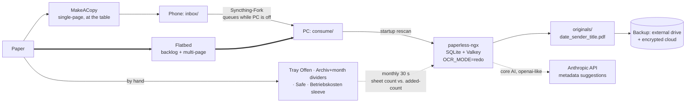

# 💡 Concept: Private Paper Filing — Capture, Index, Two Trays

## 📌 Status

`DRAFT` · v5 (v2 rewrote v1 by deletion; v3 folded in the flatbed; v4 added a "closed volumes" framework; **v5 deletes that framework again** after a second adversarial review found its load-bearing technical fact was false and its own flagship example failed its own test)

| Field | Value |
|---|---|
| Created | 2026-08-22 |
| Household | 2 adults, 2 children · own house (built ~2023) · 2–3 rental apartments |
| Capture device | Android **plus an existing flatbed scanner** (user, 2026-08-22) |
| Storage | Local PC only, not always on (user decision) |
| LLM | External API calls acceptable for interpretation; storage stays local (user decision) |
| Serial numbers | Dropped — user confirmed indifference to writing a number on the paper (2026-08-22) |
| Adversarial review | `REVISE` → resolved by **deletion**, see below · reviewer: **same-model-fallback** (no `reviewer_model` configured — the review carries the same blind spots as self-critique to a real degree) |

> ⚠️ **v1 of this concept was built around pre-printed serial-number labels. That is now deleted.**
> The review's core argument held: the number solved a problem this household does not have, and
> everything downstream of it — the label supply, a PDF-only capture constraint, a silent failure
> mode, even the choice of DMS — was scaffolding on a two-minute-a-year benefit. What replaced it is
> smaller, needs no consumables, and requires nothing to be written on the paper at all.

---

## 🎯 Problem Statement

Paper arrives daily — insurance, invoices, school, municipality, the house build, the rental
apartments — and in parallel invoices arrive by email and money moves across several bank accounts.
Today all of this is reconciled by hand.

The user's sketch: photograph each arriving letter with an Android phone; decide *archive* or
*something still to do*; get a **number** to write on the paper; be told which binder it goes in;
keep image + number locally. Later: an LLM reads the images so "give me all letters from Sparkasse"
works, open actions are tracked, and eventually email invoices, bank statements and tax preparation
join in.

### The denominators — four, not one

An earlier version of this concept used a single denominator (~300 documents/year) and let it
justify the whole design. That was the wrong measurement. Documents/year decides almost nothing
here. **Four separate numbers each govern a different component, and they point in different
directions:**

| Denominator | Estimate | What it governs |
|---|---|---|
| **Capture-seconds/year** — the only *recurring cost* | Phone-only: ~300 captures × 45–90 s, multi-page items 3–5 min ≈ **6–12 h/year, forever**. **With the flatbed absorbing multi-page items, realistically 3–6 h/year** (see Principle 8) | Every second added to the per-letter ritual is multiplied by 300. This is the budget the design must protect above all else. |
| **Physical pulls/year** — how often anyone removes an actual sheet | Belegeinsicht 0–1 per property, insurance/warranty case 0–2, Finanzamt query 0–1 ⇒ **~2–6/year** | Any scheme for *addressing a physical sheet*. At this rate, a serial number cannot pay for itself. |
| **Digital lookups/year** | tax season + ad-hoc ⇒ **~30–60/year** | The OCR + full-text index. Clearly worth software. |
| **Deadlines missed/year, today** | **unknown — the user has never counted** | Whether an action-tracking stage should exist at all. If it is 0–1, building it is waste. |

Note the split the raw "20–30 letters/month" figure hides: *mail received* is realistically 40–60
per month once advertising and throwaways are counted, while *documents worth capturing* is more
like 8–15. Cost scales with the first if the rule is "photograph everything"; benefit scales with
the second.

⚠️ **Two of these must be measured before building.** Count one real month of *capture-worthy* post,
and count how many deadlines were actually missed in the last year. The second number alone decides
whether Stage 3 exists.

---

## 🔑 What already exists, and what is genuinely missing

**Paperless-ngx** (v3.0.5, 2026-08-01, 44,487 stars, 13 open issues, GPL-3.0,
[GitHub API](https://api.github.com/repos/paperless-ngx/paperless-ngx)) already provides OCR,
full-text search, tagging, correspondents, custom fields, a phone-reachable web UI, native IMAP mail
ingest, a documented REST API, and — since v3.0 — first-party LLM metadata suggestions.

Its docs also contain a workflow almost identical to the user's sketch, built on an **Archive Serial
Number (ASN)**: write a running number on each document, file in a single binder sorted by ASN
([usage.md](https://github.com/paperless-ngx/paperless-ngx/blob/main/docs/usage.md)).

**This concept deliberately does not use it.** The reasoning is in Principle 1.

So almost nothing needs to be built. The work is in **deciding what to switch on, what the physical
routine is, and what to refuse** — which is where the rest of this document goes.

---

## 💡 Proposed Solution

### Principle 1 — The physical address is the filing month, and it is assigned by the act of filing

The user asked for a number to write on the paper. This concept declines to give him one, and
substitutes something that costs zero seconds per letter.

**Why not a number.** A serial number's only job is to address a physical sheet. This household
pulls a physical sheet **2–6 times a year**. Against that, a number charges: a peel-and-stick or
pen stroke on all ~300 captures; a consumable that must never run out or be re-ordered into an
overlapping range; a PDF-only constraint on the capture app, because barcode detection does not work
on JPG ([issue #12422](https://github.com/paperless-ngx/paperless-ngx/issues/12422)); and a failure
mode that is invisible exactly where it happens — a duplicate ASN means *"the document will not be
consumed and an error logged"*
([configuration.md](https://github.com/paperless-ngx/paperless-ngx/blob/main/docs/configuration.md)),
i.e. logged to a container on a switched-off laptop while the paper is already filed under a number
that resolves to something else.

It also fails on its own terms. Paperless' ASN is a **single global sequence** — multiple sequences
are unsupported and the implementing PR was **closed unmerged on 2026-07-20**
([#1841](https://github.com/paperless-ngx/paperless-ngx/discussions/1841),
[PR #13172](https://github.com/paperless-ngx/paperless-ngx/pull/13172)). Spread one sequence across a
to-do tray and an archive and the number no longer tells you *where* the sheet is; you have to ask
the app — which lives on the PC the whole design assumes is off.

**What replaces it.** Paperless stamps every document with `added` — a non-editable, indexed,
filterable timestamp set automatically at consumption
([models.py](https://github.com/paperless-ngx/paperless-ngx/blob/main/src/documents/models.py),
[filters.py](https://github.com/paperless-ngx/paperless-ngx/blob/main/src/documents/filters.py)).

So: **the archive binder gets month dividers, and a sheet goes behind the divider for the month you
filed it.** That's it.

- **Nothing is written on the paper.** No pen, no sticker, no allocator, no supply chain. The
  capture ritual loses a step instead of gaining one — which is the budget that matters most.
- **Strictly append-only.** Filing date only ever moves forward, so a sheet is *always* placed at
  the back. Letter dates arrive out of order; filing dates cannot. There is never an insertion.
- **Collision-free across two phones by construction** — there is nothing to collide.
- **The index addresses it exactly.** "Sparkasse letter, added 2026-03" → March divider → ~25 sheets
  to eyeball, a handful of times a year.
- **It makes the system self-auditing** (see Principle 6), which the numbered design could not do.

### Principle 2 — Two trays, as originally asked, plus one location the law forces

The user proposed two trays: *archive* and *still to do*. That is restored — an earlier version of
this concept split it into three, which added a legal judgement call ("does this paper have legal
force?") to the kitchen table for no gain.

| Location | Contents | Who decides | Notes |
|---|---|---|---|
| **Tray "Offen"** | Anything with an open action | the person opening the post | Should trend to zero. When the action is done, the sheet moves to the archive **behind the current month divider** — an append, never an insertion. |
| **"Archiv"** binder + month dividers | Everything else worth keeping | default | Binder full → label it `2026-01 … 2026-08`, cellar, next binder. |
| **Safe** | Notarial deeds, Grundbuch, certificates, references, pension records, wills, guarantees | rare and obvious | **Not a system component** — the household already owns it and already browses it by eye. It is listed only so the retention table can point at it. |
| **Sleeve "Betriebskosten · Wohnung X · 2026"** | Invoices that will appear in a Nebenkostenabrechnung | "is this a bill for a rental apartment?" | Forced by law, not by design — see Principle 4. |

Everything is photographed, whatever stack it lands on.

### Principle 3 — The paper archive is append-only; all reorganization is virtual

The user asked to be able to later say *"put all rental matters for apartment X into a rental
binder."* This concept declines that too, and the reason is the same one driving the whole project:
**physically re-filing paper is the manual work he is escaping.**

"All rental matters for apartment X" is a saved filter that returns a list. If paper is ever
actually needed, the list says which month dividers to look behind. The physical archive is
chronological forever and is never touched again after filing.

The one exception is Principle 4, where the law overrides this — and that exception is handled by
*routing at capture*, which is cheap, rather than by re-filing later, which is not.

### Principle 4 — The classifier's most valuable job is flagging "keep the paper"

> ⚠️ **General information, not legal or tax advice.** Two rows below are genuinely unsettled for
> this household and need a Steuerberater; they are marked.

The single most consequential legal finding is one the user is unlikely to have on his radar:

**BGH, Urteil v. 15.12.2021 – VIII ZR 66/20** — tenants may inspect the **original** Betriebskosten
receipts as the rule, without having to show any special interest or suspicion; *"Kopien sind
Originalbelegen grundsätzlich nicht gleichgestellt"*
([Haufe](https://www.haufe.de/immobilien/verwaltung/bgh-vermieter-muss-original-belege-vorlegen_258_560186.html),
[§ 259 BGB](https://www.gesetze-im-internet.de/bgb/__259.html),
[§ 556 BGB](https://www.gesetze-im-internet.de/bgb/__556.html)).

This is a scheduled, annual, per-property, originals-only event. Servicing it out of a purely
chronological archive would mean pulling 20–40 specific sheets across a year boundary and re-filing
every one — annually, per apartment. **That is exactly the manual work Principle 3 exists to
prevent, so the law wins and these receipts get routed to a per-property sleeve at capture time.**

The retention table below states **floors, not shred clocks** — the earliest a document could be
discarded, in a system that (per Principle 7) discards nothing yet:

| Category | Where | Original needed? | **Keep at least** | Basis |
|---|---|---|---|---|
| **Craftsman/building invoices on the own house** | Archiv | scan sufficient | **5 years from Abnahme** — i.e. ~2028 for the 2023 build | **[§ 634a Abs. 1 Nr. 2, Abs. 2 BGB](https://www.gesetze-im-internet.de/bgb/__634a.html)** — Mängelansprüche at a *Bauwerk* prescribe in five years, running from Abnahme. ⚠️ The § 14b UStG duty below is only **2 years**; treating that as the keep-period would throw away the evidence needed for a defect claim. This is the most valuable retention rule for this household. |
| *(the same invoices, as a tax duty)* | — | — | 2 years from end of invoice year | [§ 14b Abs. 1 S. 5 UStG](https://www.gesetze-im-internet.de/ustg_1980/__14b.html). The invoice must itself state this duty ([§ 14 Abs. 4 Nr. 9 UStG](https://www.gesetze-im-internet.de/ustg_1980/__14.html)) — a reliable auto-classification signal. Breach: fine up to **1.000 €** ([§ 26a UStG](https://www.gesetze-im-internet.de/ustg_1980/__26a.html)); *many German pages still say 500 € — stale.* |
| **Purchase contracts + construction/acquisition costs for the rentals** | Safe | yes | **the entire AfA period — decades** | These set the depreciation base and must survive as long as the asset is written down. No fixed-year rule applies. |
| **Invoices feeding a Nebenkostenabrechnung** | **Betriebskosten sleeve** | **Yes — do not shred** | ≥ 12-month Abrechnungs window + 3 y Regelverjährung | BGH VIII ZR 66/20, above |
| Craftsman invoices **on the rentals** | Archiv | scan sufficient | ⚠️ **unsettled — plausibly 8 years**, but see AfA row: if capitalised, decades | A private residential landlord **is Unternehmer** under § 2 UStG though letting is VAT-exempt, so the 2-year privilege of § 14b Abs. 1 S. 5 plausibly does not apply. ⚠️ Separately unsettled: whether § 147 AO binds this household at all, since Vermietung is *Überschusseinkünfte* and generally outside its Aufzeichnungspflicht absent the [§ 147a AO](https://www.gesetze-im-internet.de/ao_1977/__147a.html) 500k € threshold. **Two independent questions — put both to a Steuerberater.** |
| **§ 35a EStG Handwerkerleistungen** (the reason most of these invoices exist) | Archiv | scan sufficient | until the Bescheid is bestandskräftig | Invoice **plus non-cash payment proof** must be producible on request |
| Ordinary tax-relevant receipts (private) | Archiv | scan sufficient | ~4–7 y | No general duty for private persons; what binds is Festsetzungsverjährung — 4 years plus up to 3 years Anlaufhemmung ([§ 169](https://www.gesetze-im-internet.de/ao_1977/__169.html), [§ 170 AO](https://www.gesetze-im-internet.de/ao_1977/__170.html)) |
| Steuerbescheide | Safe | yes | 10 y, longer under Vorläufigkeitsvermerk / Vorbehalt der Nachprüfung | [Verbraucherzentrale](https://www.verbraucherzentrale.de/wissen/digitale-welt/datenschutz/aufbewahrungspflichten-welche-unterlagen-muss-ich-wie-lange-behalten-84296) |
| Urkunden, certificates, references, pension, wills, guarantees | Safe | **Yes — a scan is evidence *about* the document, not the document** | permanently (judgments ≥30 y) | Verbraucherzentrale |
| Everything else (Müllbescheid, routine churn) | Archiv | no | until the next tax year closes | — |

Two more findings worth encoding:

- **Photographing is explicitly permitted** where a retention duty exists: the GoBD replaced
  "Scannen" with the broader **"bildliches Erfassen"** and **Rz. 130 names smartphones**
  ([GoBD, last amended 14.07.2025](https://www.bundesfinanzministerium.de/Content/DE/Downloads/BMF_Schreiben/Weitere_Steuerthemen/Abgabenordnung/2025-07-14-GoBD-2-aenderung.pdf?__blob=publicationFile&v=3),
  [§ 147 Abs. 2 AO](https://www.gesetze-im-internet.de/ao_1977/__147.html)). But GoBD bind
  Buchführungspflichtige, not pure private persons — for this household a **quality template, not an
  obligation**.
- **Thermal-paper receipts must be captured promptly** — the original physically fades.

### Principle 5 — Configure the LLM that ships; write none

An earlier version proposed a hand-written Claude Code batch skill, justified by two claims that
turned out to be false. Both are corrected here:

- **Anthropic *is* reachable from paperless core AI.** `PAPERLESS_AI_LLM_BACKEND=openai-like`
  combined with `PAPERLESS_AI_LLM_ENDPOINT` targets any OpenAI-compatible provider, and Anthropic
  ships such an endpoint.
- **`torch` + `sentence-transformers` are avoidable.** They are pulled only by the *huggingface*
  embedding backend; `PAPERLESS_AI_LLM_EMBEDDING_BACKEND=openai-like` avoids them, and embeddings are
  needed only for RAG chat, not for metadata suggestion.

So Stage 2 is a **configuration change, not a component**: switch on core AI for correspondent,
document-type and tag suggestions. A wrong suggestion costs a re-tag, not money.

Claude Code keeps a role, but a different and honest one: **ad-hoc questions against the local
folder** ("which of these look like they belong to apartment X?"), run when the user sits down. It is
not in the 300-documents-a-year path — putting a human in front of an interactive agent for 300 image
reads would re-create the manual work this project exists to remove.

Cost is not a decision input here — at published rates this is single-digit euros per year either
way — so it is stated once and not used to justify anything
([pricing](https://platform.claude.com/docs/en/about-claude/pricing)).

> **Deliberately not built:** an MCP server (no official one; the most-starred community server is
> 9 months stale **and has no licence file**), and any third-party AI bolt-on — `paperless-ai`
> (5,905 stars) now carries the banner *"This repo is currently not maintained"*, its author citing
> the official integration.

### Principle 6 — Assume capture silently stops, and make that visible for free

The review's sharpest practical point: the realistic failure is not abandonment on day one. It is
month three, when one adult keeps *filing* but stops *scanning* — the physical half is habit, the
digital half is a chore. Or a phone stops syncing after an OEM update: Syncthing-Fork's own wiki
notes the doze exemption is required and that some OEMs kill background processes regardless. The
scanner app still says "saved". The web UI that would show the gap runs on the PC that is off.

A silently incomplete index is worse than no index, because the system's only real promise is a
trustworthy answer to *"do I have this?"*.

**Principle 1 makes the check free.** Because the physical address *is* the filing month, and
paperless can filter on `added`:

> **Monthly, 30 seconds:** count the sheets behind the previous month's divider; compare with the
> document count paperless reports for roughly that period. **Roughly equal ⇒ the chain worked.**

⚠️ **Roughly, not exactly** — and the reason matters. `added` is stamped at *consumption*, not at
filing, and the architecture guarantees a lag: a letter filed on 30 August while the PC is off gets
`added = 2 September` when the machine next boots. An exact-match check would therefore report a
false discrepancy **every single month, in both directions**, and would be ignored within two — which
is precisely the abandonment mode this check exists to catch. A drift of one or two is normal; a
drift of twenty means something broke. The divider is the address; `added` is only its index proxy.

This is not a bolt-on guard — it is a property that the numbered design could not offer, because a
number tells you nothing about what is *missing*. It also detects OEM sync kills, a full disk, a
stopped container, and a parent who quietly gave up, with one reconciliation.

### Principle 7 — Stage 1 destroys no paper

The system earns trust before it replaces anything. Keeping every sheet for the first year costs one
binder and defuses nearly every legal question above. It reframes the value honestly: **in Stage 1
the digital archive's job is *finding* paper, not *replacing* it.** It also caps the damage from
Principle 6's failure mode at lost effort rather than lost documents.

### Principle 8 — The flatbed does the hard half; the phone does the convenient half

The user confirmed a flatbed scanner already exists. That is the single most useful fact supplied,
because it removes the two worst items in the design at once.

**Multi-page documents were the real cost.** A Nebenkostenabrechnung, a Steuerbescheid or a contract
is 4–10 pages, and on a phone that is 3–5 minutes of frame-crop-confirm per document — by far the
largest entry in the capture-seconds budget, and the step most likely to be skipped in month three.
On a flatbed (especially with a sheet feeder) it is one pass.

**Phone photos were also the weakest input.** Every OCR source recommends 300 DPI flat scanning, and
a 5° tilt alone costs ≥15% word error rate. The SmartDoc-QA line of work exists precisely because
hand-held capture degrades OCR through blur, lighting, shadow and geometric distortion. A flatbed
sidesteps all of it — and with it, most of the remaining argument for ever reaching for vision-LLM
OCR.

So the capture design splits by document shape, not by preference:

| Path | Use for | Why |
|---|---|---|
| **Flatbed → `consume/` directly** | the entire 3-month backlog · everything multi-page · anything where the numbers matter (invoices, Bescheide, contracts) | best OCR input, no sync hop, one pass per document. The PC is on anyway when batch scanning. |
| **Phone (MakeACopy → Syncthing)** | single-page items at the kitchen table, when you do not want to walk to the PC | convenience, and it is the path that tolerates a powered-off PC |

Two consequences worth stating:

- **The backlog stops being a project.** 60–100 documents through a sheet feeder is an afternoon,
  not a campaign — and it is the highest-quality data the archive will ever get.
- **`PAPERLESS_OCR_MODE=redo` matters only for the phone path.** A flatbed producing image-only PDFs
  gets OCR'd by paperless normally; MakeACopy's on-device text layer is what `redo` overrides.

If the scanner can scan-to-folder over the network, point it straight at `consume/` and the phone
path becomes purely optional. If it is USB-only, scan into a local folder that Syncthing also
watches — same result, one extra hop.

### Three questions about bounded sets

An earlier version answered these with a new category ("closed volumes"), a three-part test and a
comparison table. **That framework has been deleted.** Adversarial review showed it produced exactly
two objects in ten years, that its own flagship example failed its own criterion, and that the
technical fact it rested on was false. Two objects need two answers, not a taxonomy.

**The false fact, corrected first, because it was load-bearing.** v4 claimed `added` is
`editable=False` and therefore *unchangeable*. `editable=False` is a Django **form-layer** flag — it
keeps a field out of ModelForms and skips it in model validation; it is not a database constraint.
`added` is serialized verbatim into paperless' export manifest, read back by the importer, and
settable in one line via `manage.py shell`. What is true is narrower: **DRF maps `editable=False` to
`read_only=True`, so `added` cannot be changed through the UI or the REST API.** That is a
*convention*, not an invariant — enough to build on, but the concept must not claim more.

#### Answer 1 — the 3-month backlog

Your instinct is right: scanned in August, all ~100 documents get `added = 2026-08`, whatever date is
printed on them.

Backdating them into retroactive May/June/July dividers *is* technically possible (see above). It is
still the wrong move — it scatters a one-off pile across three dividers and starts the running
archive dirty, for no retrieval benefit.

**So the backlog becomes binder zero.** One binder labelled `Altbestand bis 2026-08`, shelved before
the first month divider. Scan the pile in whatever order it is already in, file it in that same
order, tag it `altbestand`. The running archive starts *empty* at its first month.

This is not a new scheme — Principle 1 already labels a finished binder by its range (*"Binder full →
label it `2026-01 … 2026-08`, cellar, next binder"*). Altbestand is simply the volume before the
first.

⚠️ v4 told you to sort the pile by document date first, calling it *"one pass, costs nothing extra"*.
**Deleted.** Sorting 60–100 items by hand is 30–60 minutes; multi-page items must be clipped first or
they interleave and destroy the scan order; many sheets carry no unambiguous date at all (a
Kontoauszug carries a period, an invoice carries three candidate dates). The payoff would be ~15
seconds of flipping in a binder you open perhaps once a year.

#### Answer 2 — the old binders, three years back

**Don't.** But your own question contains the better rule, because you named a *purpose*
(Herstellungskosten), not a period.

**Retro-digitize by purpose, never by completeness.** "Three years back" is a completeness goal whose
payoff is search over documents you have demonstrably not searched in three years. "Everything
belonging to the house build" is a purpose, it is bounded, and it has a payoff.

Old binders are also *already organized* — that is what a binder is. Whether you want search over
them is measurable: for the next six months, note every time you actually walk to the cellar.

#### Answer 3 — Hausbau: digital yes, binder no

**Estimating the cost is digital, and a binder actively does not help** — it gives you a stack to
flip and sums nothing. Paperless has a native **`MONETARY`** custom-field type (verified in the
model): tag `hausbau`, field `betrag`, filter, export, sum.

**Scan the build documents and put them straight back into the old binders they came from.** No new
binder. v4's reasons for a physical Hausbau volume do not survive:

- *"Originals may matter for § 634a defect claims"* — contradicted by this concept's **own retention
  table**, which already adjudicated build invoices on the own house as **"scan sufficient"**, in the
  very row that cites § 634a.
- *"It is what you hand to a Steuerberater"* — contradicted one paragraph earlier: the complete,
  sourced, summed list **is** the better hand-over artifact.
- § 634a runs out ~2028, so it would be a permanent physical object serving a reason with a two-year
  shelf life, in a concept that never re-files anything.

The `hausbau` tag records which old binder each original sits in, so nothing is lost.

⚠️ **Three warnings on the number itself — the last two are corrections to v4:**

- **Principle 6 at full strength.** Every amount must be checked against its image before entering a
  sum — LLM extraction drifts precisely on amounts. For 100–300 invoices that is real one-time work,
  still far less than reconstructing it from paper.
- **A sum of invoices is not "Herstellungskosten".** [§ 255 Abs. 2 HGB](https://www.gesetze-im-internet.de/hgb/__255.html)
  defines the term and Abs. 3 excludes borrowing costs — but **the rule with the most money attached
  for a household with 2–3 rentals is [§ 6 Abs. 1 Nr. 1a EStG](https://www.gesetze-im-internet.de/estg/__6.html)**:
  *"Zu den Herstellungskosten eines Gebäudes gehören auch Aufwendungen für Instandsetzungs- und
  Modernisierungsmaßnahmen, die innerhalb von drei Jahren nach der Anschaffung des Gebäudes
  durchgeführt werden, wenn die Aufwendungen ohne die Umsatzsteuer 15 Prozent der Anschaffungskosten
  des Gebäudes übersteigen"* (anschaffungsnahe Herstellungskosten). It reclassifies immediately
  deductible Erhaltungsaufwand into decades-long Herstellungskosten — and it is itself a **retention
  rule**, because you must be able to evidence the three-year spend. **Classification is a
  Steuerberater call; what the system delivers is the sourced list.**
- **For a self-occupied house the tax motive is weaker than it looks.**
  [§ 23 Abs. 1 Nr. 1 S. 3 EStG](https://www.gesetze-im-internet.de/estg/__23.html) exempts assets used
  *"ausschließlich zu eigenen Wohnzwecken"*. What remains: a later conversion to rental (the figure
  then becomes the AfA basis under § 7 Abs. 4 EStG), § 634a until ~2028, insurance valuation.
  ⚠️ For the **rental apartments** § 23 does bite within ten years — but **not "directly"**, as v4
  said: § 23 Abs. 3 S. 4 EStG requires the Anschaffungs-/Herstellungskosten to be *reduced by the AfA
  already claimed*, so a raw invoice sum overstates the deductible basis.

---

## 🙅 Where this concept overrides what you asked for

Stated explicitly, because three of the user's requests were declined:

| You asked for | What you get instead | Why |
|---|---|---|
| A number to write on the paper | Nothing written on the paper; the filing month is the address | The number costs ~300 pen strokes a year to save ~2 minutes a year of flipping. Principle 1. |
| Two *numbered* trays (archive / to-do) | Two trays, unnumbered — otherwise exactly as you drew it | The trays were right. Only the numbering is dropped. |
| The app tells you which binder | The retention table tells you; the app suggests metadata after the fact | With two trays and a safe, the routing decision is a 2-second human call. Software adding a round-trip here would slow the one step that must stay fast. |
| Later: a physical binder for apartment X | A saved filter that lists which month dividers to look behind | Physical re-filing is the work you are escaping. **Exception:** Betriebskosten receipts genuinely do need their own physical sleeve — the BGH forced that, see Principle 4. |

---

## 🏗️ Architecture

**Verified to tolerate a powered-off PC:**

- **Syncthing queues by construction** ([FAQ](https://docs.syncthing.net/users/faq.html)).
  ⚠️ The official `syncthing/syncthing-android` is **archived** (retired 2024-10-20,
  [announcement](https://forum.syncthing.net/t/discontinuing-syncthing-android/23002)). The live path
  is **Syncthing-Fork** (`researchxxl/syncthing-android`, MPL-2.0, v2.1.3.0 on 2026-08-05,
  [F-Droid](https://f-droid.org/api/v1/packages/com.github.catfriend1.syncthingfork)) — sideload,
  not on Play. **Grant the doze exemption and verify it survives OEM updates** (Principle 6 catches
  it if not).
- **Paperless consumes on startup** — `_process_existing_files()` runs before the watcher, plus a
  300 s full-glob rescan
  ([document_consumer.py](https://github.com/paperless-ngx/paperless-ngx/blob/main/src/documents/management/commands/document_consumer.py)).
- **`PAPERLESS_CONSUMER_STABILITY_DELAY`** (default 5 s) prevents consuming half-synced files.

**Capture app (phone path only — see Principle 8).** With the barcode constraint gone, the format
requirement is gone with it — any scanner app works. [MakeACopy](https://github.com/egdels/makeacopy) (FOSS, F-Droid 4.6.1) is still
the recommendation, because it is offline, has good perspective correction, and documents the exact
`Scan → Inbox → sync → paperless-ngx` pipeline. **But it OCRs on-device and emits a *searchable*
PDF**, and paperless' default `PAPERLESS_OCR_MODE=auto` *"detects whether a document already has
embedded text … If sufficient text is found, OCR is skipped"*
([configuration.md](https://github.com/paperless-ngx/paperless-ngx/blob/main/docs/configuration.md)).
Left at the default, the archive's text layer would be the phone's, and paperless' own OCR would
never run. **Set `PAPERLESS_OCR_MODE=redo`** — or disable OCR in MakeACopy.

**Stage 0 configuration — the non-obvious ones, all verified against current docs:**

| Setting | Why |
|---|---|
| `PAPERLESS_SECRET_KEY` | **Required** — *"Paperless will refuse to start if this is not set."* |
| `PAPERLESS_OCR_MODE=redo` | Otherwise the phone's OCR wins and Tesseract never runs |
| `PAPERLESS_OCR_LANGUAGE=deu` | German |
| `PAPERLESS_CONSUMER_DELETE_DUPLICATES=true` | v3 no longer rejects duplicates by default — relevant for "did I already scan this?" |
| `PAPERLESS_CONSUMER_IGNORE_DIRS` | For Syncthing's `.stfolder` / `.stversions`. If file versioning is on, `.stversions` is a re-consumption hazard. |
| `PAPERLESS_CONSUMER_IGNORE_PATTERNS` | Add `^\.syncthing\.` — **v3 changed these from fnmatch to regex**, with an explicit warning that glob-looking patterns match nearly everything |
| `PAPERLESS_FILENAME_FORMAT` + `..._REMOVE_NONE=true` | Meaningful filenames on disk. `REMOVE_NONE` defaults to `false`, so unset placeholders otherwise render the literal string `none`. |
| pinned image tag | 154 issues were opened in the month after v3.0.0 — including a restart loop on upgrade and **OCR silently not running** ([#13349](https://github.com/paperless-ngx/paperless-ngx/issues/13349)). All closed; **never auto-update.** |

**Deployment.** Two containers: `valkey:9-alpine` + the paperless webserver, SQLite in a volume — no
Postgres, no Tika/Gotenberg
([docker-compose.sqlite.yml](https://github.com/paperless-ngx/paperless-ngx/blob/main/docker/compose/docker-compose.sqlite.yml)).
No official RAM/CPU minimum is published; anyone quoting one is inventing it.

**On the exit story — stated honestly, not as insurance.** `PAPERLESS_FILENAME_FORMAT` gives a
readable folder tree, but the docs warn: *"Do not manually move your files in the media folder …
paperless will report your files as missing."* The tree is paperless', not yours. And exports are
version-locked: *"You cannot import the export generated with one version of paperless in a different
version"*
([administration.md](https://github.com/paperless-ngx/paperless-ngx/blob/main/docs/administration.md)).
**So the real position is: the PDFs are safe and portable; the *organisation* — tags, correspondents,
saved filters — lives in the DB and would be lost in a migration.** Since Principle 3 makes saved
filters load-bearing, that is an accepted risk, not a covered one.

---

## 🗺️ Stages

| Stage | Scope | Done when |
|---|---|---|
| **Measure** (before anything) | Count one month of capture-worthy post. Count deadlines missed in the last year. | Two numbers exist. If capture-worthy post is under ~10/month, the honest recommendation shrinks to a folder of PDFs and no DMS at all. |
| **0 — Capture** (one evening) | Month dividers in a binder; flatbed → `consume/` (scan-to-folder if available); MakeACopy + Syncthing-Fork + doze exemption for the phone path; paperless via SQLite compose with the settings table above; backup target | Both paths land a searchable document, and the monthly reconciliation check works |
| **1 — Backlog & routine** | **Run the 3-month pile through the flatbed in one afternoon**, in whatever order it is already in, into binder zero `Altbestand bis 2026-08` (Answer 1) — highest-quality input the archive will get; start the running archive *empty*; establish the two trays + Betriebskosten sleeves; tags per property | The pile is gone, the running archive starts clean at month one, and the tray is the only paper without a decision |
| **2 — Suggestions** | Switch on core AI (`openai-like` → Anthropic). Spot-check ~20 documents. | Correspondent/type suggestions are right often enough to accept blind |
| **3 — Actions** — ⚠️ **conditional** | Build **only if** the measured missed-deadline count is ≥3/year. Otherwise: the person who opens the letter puts it in Offen and writes the date in the shared family calendar. | — |
| **4 — Outlook (do not build)** | Email invoices (paperless has native IMAP mail rules), bank statements, tax agent | only the seam is defined: everything becomes a document with custom fields |

**Old binders: leave them alone** — with one principled exception. Draw a line at the start date and
retro-digitize a document only when it is actually needed. Bulk-scanning years of history is the
classic way these projects die before delivering anything. The exception is **purpose-driven**
retro-digitization of a closed set with a payoff — the house build being the obvious candidate
(Answer 3 above). Never "three years back" as a completeness goal.

---

## ⚖️ Trade-offs & Alternatives

**The honest minimum.** Measure first (above). If capture-worthy volume is under ~10/month, the right
answer is MakeACopy + Syncthing + a dated folder, and no DMS. Paperless is included for exactly one
increment — OCR + full-text index + a phone-reachable UI — plus one option value: **native IMAP mail
ingest**, which is the seam to the user's Stage 4.

**Decided: paperless-ngx over [Papra](https://github.com/papra-hq/papra).** v1 rejected Papra *for
lacking ASN*; that reason evaporated with Principle 1, so the call was re-made on its merits. Papra
is genuinely attractive — single `docker run`, SQLite, ~5.2k stars, far less to go wrong. Three
things decide it for paperless anyway, and the user's scanner tipped the first:

1. **Batch consume-folder ingest is paperless' core competence** — stability delay, duplicate
   handling, recursive subdirectories, startup rescan. With a flatbed feeding it an afternoon's
   backlog, that maturity is used on day one rather than hypothetically.
2. **Native IMAP mail rules** are the seam to the user's Stage 4 (email invoices). Building that
   later against Papra would be new work.
3. **This is a decade-long archive.** 44k stars and 13 open issues versus a project created in
   Jan 2025 is the right way to weigh a store you intend to still be reading in 2036.

Papra stays the documented fallback if paperless operations ever become a burden.

**Rejected: a DIY pipeline** (OCRmyPDF + SQLite FTS5, ~200 lines). No server, no Docker, no upgrade
churn — genuinely attractive. Rejected because it re-implements OCR orchestration, dedup, thumbnails,
tagging, a web UI and mail ingest: the wheel the user said he did not want to reinvent.

**Rejected: Docspell** (4 GB RAM with DB + Solr, no stable tag since March 2024), **Mayan EDMS**
(4 GB minimum, PostgreSQL + Redis + RabbitMQ — an enterprise workflow engine for a family's post),
**Teedy / Papermerge / Open Semantic Search** (weaker fit, slower cadence).

**Rejected: a vector database.** At 3,000 documents, SQLite FTS5 answers the user's own example
better than embeddings — "all letters from Sparkasse" is *lexical*, and dense retrieval is weaker on
exact proper nouns. `sqlite-vec` is pre-1.0, brute-force only, 202 open issues, no commits in ~3
months. If semantic recall is ever wanted, paperless' own opt-in LLM index provides it.

**Accepted risks.**
- **v3.0 is a young release train** — mitigated by pinning, not by hope.
- **Local-only storage means one disk failure loses everything.** An external drive plus an
  encrypted cloud copy of `originals/` is not optional; this is the one place the "local only"
  preference must bend to a second copy.
- **German OCR friction is documented upstream** — umlauts as `a/o/u`
  ([#5889](https://github.com/paperless-ngx/paperless-ngx/discussions/5889)), umlauts stripped on
  import ([#4139](https://github.com/paperless-ngx/paperless-ngx/issues/4139)). ⚠️ Note the search
  citation often quoted here ([#10937](https://github.com/paperless-ngx/paperless-ngx/issues/10937))
  concerns **Whoosh, which v3 replaced with Tantivy** — treat it as stale.
- **No number an LLM produces should be trusted.** LLM vision OCR fails *silently*: on ParseBench
  (~2,000 human-verified pages) the best methods reach **~90% content faithfulness**, and the errors
  are fluent — account numbers and invoice totals drift toward familiar patterns
  ([LlamaIndex, 2026-08-03](https://www.llamaindex.ai/blog/llm-ocr)). Stage 2 is scoped to
  *suggestions* precisely so this cannot cause harm: a wrong correspondent costs a re-tag. **If
  Stage 3 is ever built, amounts and IBANs must be validated (IBAN checksum, format) and no extracted
  number may drive an irreversible action.** There is also **no German-language OCR benchmark** —
  every one found is English- or Chinese-centric.

---

## 📋 Open Questions

1. **The two measurements** (capture-worthy post/month; deadlines missed last year). Blocking for the
   scope decision and for whether Stage 3 exists.
2. **Steuerberater, two independent questions:** (a) do craftsman invoices for the rentals fall under
   § 14b Abs. 1 S. 1 UStG (8 years) rather than the 2-year private rule? (b) does § 147 AO bind this
   household at all, given Vermietung is Überschusseinkünfte and the § 147a threshold is far away?
   Blocking for any future deletion rule — **not** blocking for Stage 0/1, since nothing is destroyed.
3. **Does the scanner have a sheet feeder (ADF), and can it scan-to-folder over the network?**
   Decides whether the backlog is an afternoon or two, and whether the phone path is needed at all
   for anything but convenience. *(Resolved: a flatbed exists — Principle 8.)*
4. **Is a Hausbau cost reconstruction worth the one-time effort?** It means verifying 100–300 amounts
   by hand against their images (Principle 6). Worth deciding *before* Stage 1, so the build documents
   can be scanned in the same session as the backlog — scanned and **returned to their old binders**,
   not extracted into a new one.
5. **How often do you actually go to the cellar?** Note it for six months. It is the measurement that
   settles whether digitizing the old binders is worth anything at all.
6. **Does the "Offen" tray need a completion trigger?** Nothing in the design notices when an action
   is done. If the tray does not empty by itself in month two, that is the signal that the shared
   calendar — not software — is the missing piece.
